# egret安装pocoSDK说明

## 环境配置
* 首先下载pocoSDK 
* 然后在`egretProperties.json`中修改modules属性，添加红框内相应字段，**其中name属性必须为poco**
* 路径可以是相对路径也可以是绝对路径，具体可以参考[白鹭引擎说明文档](http://developer.egret.com/cn/github/egret-docs/Engine2D/projectConfig/configFile/index.html)中有关于 modules字段的说明

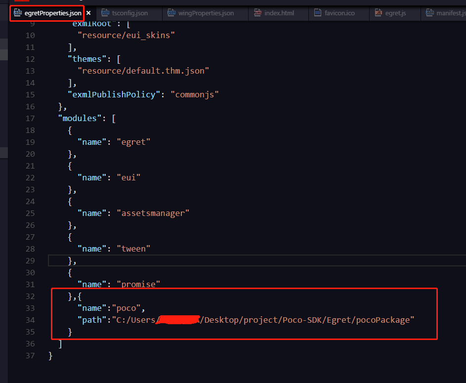

- 然后通过快捷键 ctrl+` 呼出终端 在终端中执行命令egret build -e

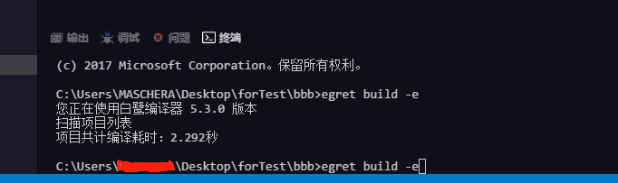

- 在入口文件`main.ts`的rungame函数中新建类型为`PocoManager`的对象，并且传入this.stage

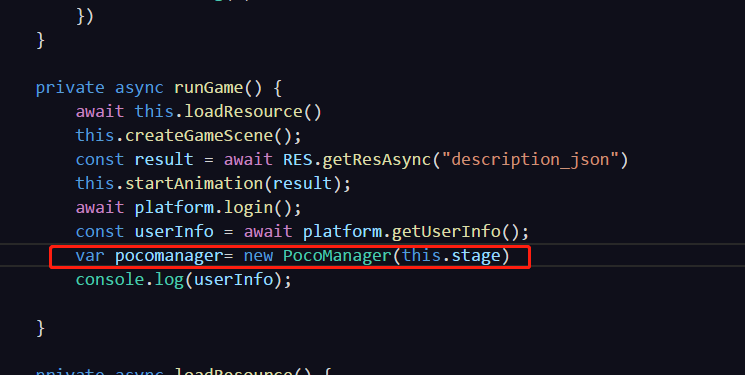

- 最后再终端中输入`python -m poco.utils.net.stdbroker ws://*:5003 tcp://*:15004`打开代理服务器
- 其中websocket端口默认为5003 如果有更改的需要可以在新建pocomanager的时候传入端口参数

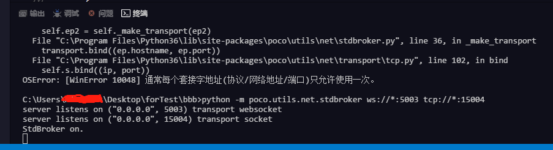

## 使用AirtestIDE连接

### 连接手机浏览器
AirtestIDE支持Android和iOS手机连接，可以在手机上打开Egret页面（或者微信小程序/游戏），然后通过AirtestIDE进行连接，Windows和MacOS版本IDE都可以使用。连接基本原理为：

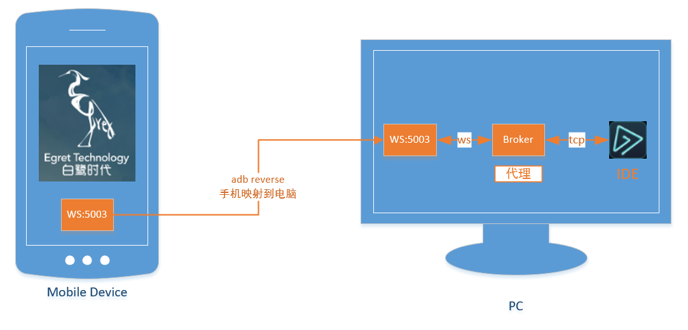

具体步骤如下：

1. 通过usb连接Android手机，确认`adb devices`连接ok，在电脑上执行如下命令：
```bash
adb reverse tcp:5003 tcp:5003
```
将手机的5003端口映射到电脑的5003端口

2. 在电脑上启动broker：
```bash
 python -m poco.utils.net.stdbroker "ws://*:5003" "tcp://*:15004"
```
启动broker之后，在手机上访问Egret的页面（需要使用全屏模式保证坐标准确）。访问的时候，broker会打印手机连接上的log，如下：
```bash
~ python -m poco.utils.net.stdbroker "ws://*:5003" "tcp://*:15004"
server listens on ("0.0.0.0", 5003) transport websocket
server listens on ("0.0.0.0", 15004) transport socket
StdBroker on.
server on accept. <poco.utils.net.transport.ws.MyWsApp object at 0x1100620d0>
```

3. 打开AirtestIDE连接手机，选择poco `Std-broker`模式，即可以看到UI层级结构。同时broker会打印连接日志：
```bash
server on accept. <poco.utils.net.transport.ws.MyWsApp object at 0x10d03d2d0>
accept from: ('127.0.0.1', 56872)
received_message from ('127.0.0.1', 56323) {"id":"2a0ce828-132e-4d15-a645-55493d7eaf4b","jsonrpc":"2.0","result":{"children"
```

AirtestIDE界面如下：

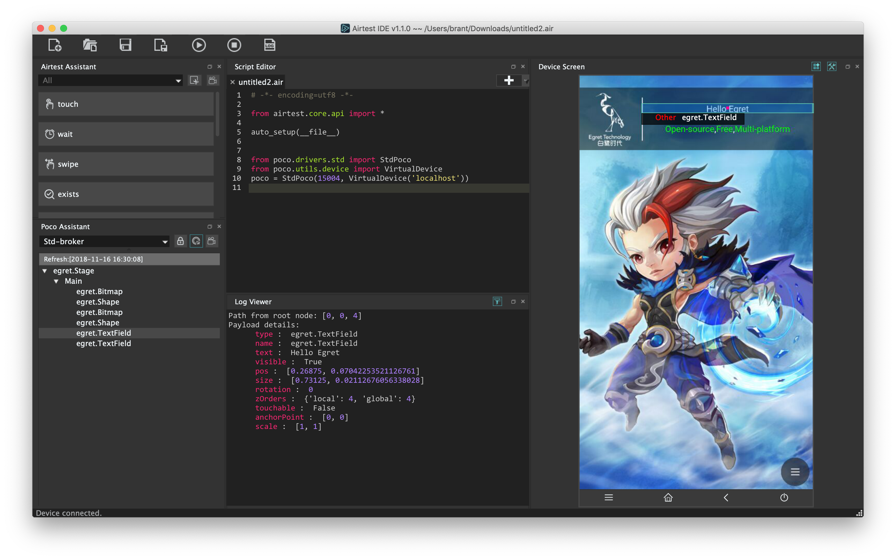

在AirtestIDE里编写脚本并运行，同时可以查看报告

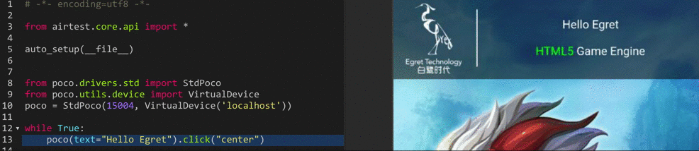

### 连接桌面浏览器
AirtestIDE也支持Windows窗口连接，MacOS窗口支持暂未放出。所以目前需要使用Windows环境连接桌面浏览器，步骤如下：

1. 运行项目，并在浏览器中打开页面，同时启动broker代理`python -m poco.utils.net.stdbroker ws://*:5003 tcp://*:15004`，如下： 

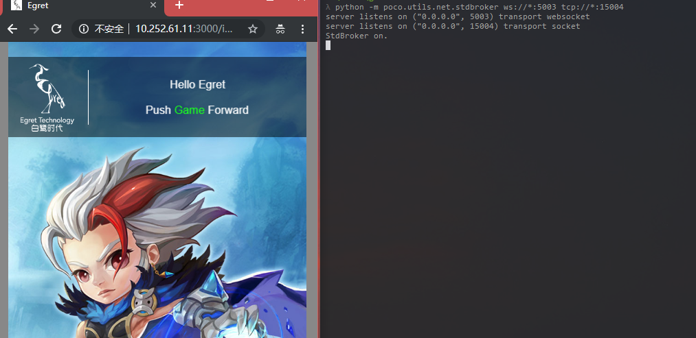

2. AirtestIDE设置windows窗口连接模式，如下设置为使用嵌入模式：

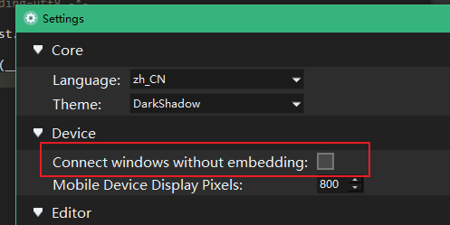

3. 使用AirtestIDE 选定窗口 功能连接浏览器窗口，连接成功后可以IDE中看到浏览器窗口：

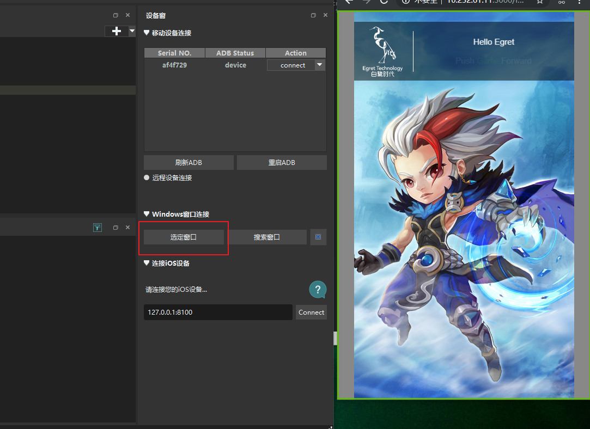

4. 在AirtestIDE中选定游戏区域，打开设置中poco window area select进行框选：

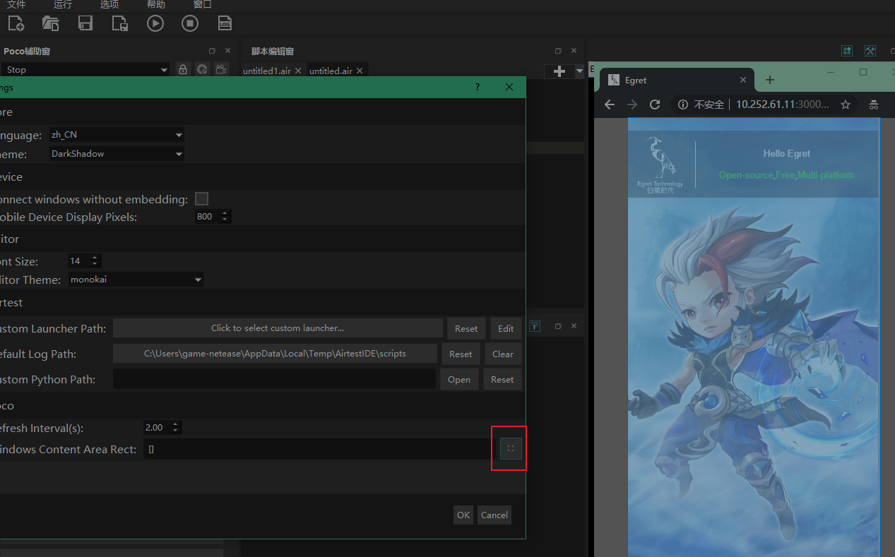

5. 确定区域之后，在AirtestIDE中即可以使用inspector功能进行UI检视：

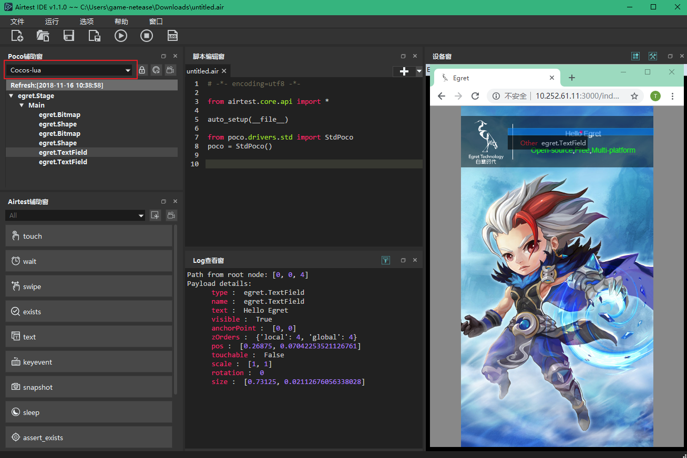

