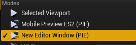

#### 具体接入步骤
1. 从 [UE4 Poco SDK](https://github.com/AirtestProject/Poco-SDK/tree/master/Unreal) 将 `PocoSDK` 这个文件夹克隆下来，放置到您项目的 `Plugins` 目录下。如果您项目没有名为 `Plugins` 的目录的话，需要先创建该目录。


2. 重新编译项目。确认在编辑器的 `Edit > Plugins` 当中能看到 `Poco SDK` ，且 `Enabled` 为被勾选的状态。

    如果此时 `Enabled` 未被勾选，请勾选 `Enabled` 并按提示重启编辑器/VS。
    
    
    
3. 运行游戏。


#### 使用方法

1. 更新最新版的Poco，指令为：
    ```
    pip install --upgrade pocoui
    ```
    注意包名为`pocoui`，而不是`poco`。更新完毕后请确认`poco`的版本号至少为1.0.79。
    
2. 连接游戏。

    启动游戏进程，在IDE中获取UI树。
    
    
    
    如图中UI树只存在`root`，则获取UI失败。
    
    在脚本层面的具体使用方法如下：
    ```
    from poco.drivers.ue4 import UE4Poco
    poco = UE4Poco()
    # example
    poco("StartButton").click()
    ```
    如果想用编辑器模式连接，可以在初始化`Poco`的时候传入参数, 此时编辑器语言需设置为英文。
    ```
    poco = UE4Poco(ue4_editor=True)
    ```
    
    
    
    此方式连接的窗口为编辑器PIE独立窗口模式，如果失败，可以自行修改`poco/drivers/ue4/device.py`下连接设备的句柄。如下列代码就是连接UE4窗口中带有`Game Preview Standalone`字样的窗口。
    ```
    dev = connect_device("Windows:///?class_name=UnrealWindow&title_re=.*Game Preview Standalone.*")
    ```
    
    UE4引擎版本号在4.26以上，UE4窗口名"Game Preview Standalone"已经修改为Preview [NetMode: Standalone]。
    

#### 一些常见的问题：

1. `Poco SDK` 未能正常启动。

    确认 `Poco SDK `为 `Enabled` 的状态。
    确认 `.uproject` 文件中包含有`Poco SDK`, 且为Enabled状态。

2. UE4选择`Standalone Game`运行游戏无法获取UI树。

    这个问题是由于插件的type为Runtime, 导致插件在编辑器运行时启动，无法获取独立进程的游戏。请使用编辑器模式运行游戏，或直接打包运行。
3. UE4打包`windows版本`游戏运行时无法获取UI树。

    运行游戏先需要先关闭UE4编辑器。

#### Access steps
1. From [UE4 Poco SDK](https://github.com/AirtestProject/Poco-SDK/tree/master/Unreal), git the directory `PocoSDK`, put the `PocoSDK` into `Plugins`. If your project does not have a directory named `Plugins`, you need to create the directory first.

2. Recompile the project. Make sure you can see the `Poco SDK` in the editor's `Edit> Plugins`, and `Enabled` is checked.

    If `Enabled` is not checked at this time, please check `Enabled` and restart the editor/VS as prompted.
    
    
    
3. run or package the game.


#### Instructions

1. Update the latest version of Poco, the instruction is：
    ```
    pip install --upgrade pocoui
    ```
    Note that the package name is `pocoui`, not `poco`. After the update, please confirm that the version number of `poco` is at least 1.0.79.
    
2. Connect the game.

    Start the game process and get the UI tree in the IDE.
    
    
    
    As shown in the figure, there is only `root` in the UI tree which fails to get UI.
    
    The specific usage at the script level is as follows：
    ```
    from poco.drivers.ue4 import UE4Poco
    poco = UE4Poco()
    # example
    poco("StartButton").click()
    ```
    If you want to connect in editor mode, you can pass in parameters when initializing `Poco`, at this time the editor language needs to be set to English.
    ```
    poco = UE4Poco(ue4_editor=True)
    ```
    
    
    
    The window connected in this way is the editor PIE independent window mode, If it fails, you can modify the handle of the connected device under `poco/drivers/ue4/device.py`. For example, the following code is to connect to the window with `Game Preview Standalone` in the UE4 window.
    ```
    dev = connect_device("Windows:///?class_name=UnrealWindow&title_re=.*Game Preview Standalone.*")
    ```
    
    The UE4 engine version number is above 4.26, and the UE4 window name "Game Preview Standalone" has been modified to Preview [NetMode: Standalone].
    

#### Some common problems：

1. `Poco SDK` failed to start normally.

    Confirm that `Poco SDK` is in the state of `Enabled`.
    Make sure that the `.uproject` file contains `Poco SDK` and is in the Enabled state.

2. UE4 chooses `Standalone Game` to run the game and cannot get the UI tree.

    This problem is because the plug-in type is Runtime, which causes the plug-in to start when the editor is running, and independent process can not get the port when editor is running. Please use the editor mode to run the game, or directly package and run.
3. The UI tree cannot be obtained when the UE4 packaged `windows version` game is running.

    To run the game, you need to close the UE4 editor first.
